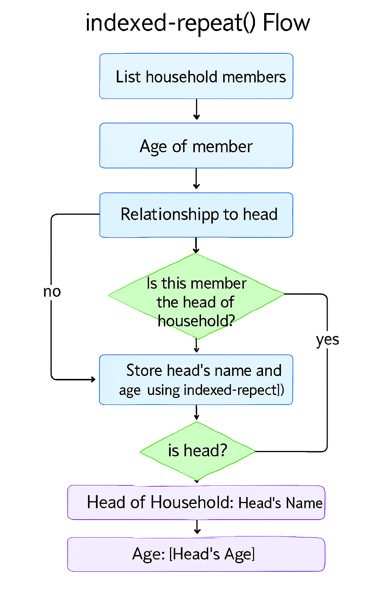

# 🧮 SurveyCTO Head-Based Aggregation Module

This bilingual SurveyCTO form is designed to extract and summarize key data from the head of household using indexed-repeat logic. It enables clean aggregation of head-level attributes (e.g., name, age) for use in downstream forms, dashboards, or summary screens.

---

## 📦 What’s Included

- ✅ Repeat group for listing household members
- ✅ Identification of head using relationship field
- ✅ Indexed reference to head’s name and age
- ✅ Household summary note for review
- ✅ Bilingual labels (English and Bangla)

---

## 🧠 Code Logic Explained (For Learners)

| 🔧 Expression | 💡 What It Does | 🧑‍🏫 Simple Explanation |
|--------------|----------------|-------------------------|
| `position(..)` | Assigns a unique ID to each household member | Think of it like numbering each person: 1st, 2nd, 3rd... |
| `if(${relationship}='head', 1, 0)` | Flags the head of household | If someone is marked as "head", this returns 1 (true); otherwise 0 |
| `max(${is_head_local})` | Stores the index of the head | Finds the position of the person marked as head |
| `indexed-repeat(${name}, ${hh_member}, ${head_index})` | Pulls the head’s name from the repeat group | It looks up the name of the person marked as head |
| `indexed-repeat(${age}, ${hh_member}, ${head_index})` | Pulls the head’s age from the repeat group | It looks up the age of the person marked as head |

---

## 🌐 Languages Supported

- **English** – Default labels and hints  
- **Bangla** – Parallel labels for field-level clarity

---

## 📥 Download the XLSForm

You can download the latest version of the **Head-Based Aggregation Module** directly from this repository:

**🔗 [Download SurveyCTO_Head_Based_Aggregation_Module.xlsx](assets/SurveyCTO_Head_Based_Aggregation_Module.xlsx)**

This file includes:
- Indexed-repeat logic to pull head’s name and age
- Household summary note for review
- Bilingual labels for field clarity

> Tip: Use this module as a bridge to downstream forms or dashboards that rely on head-level data.

---

## 📘 Enumerator Script (Bangla-English)

This PDF provides a bilingual script for training enumerators on how to use the Head-Based Aggregation Module effectively in the field.

**🔗 [Download Enumerator_Script_ENBN.pdf](hh_indexed_repeat_group/Enumerator_Script_ENBN.pdf)**

Includes:
- Step-by-step instructions  
- Head identification guidance  
- Bangla-English translations  
- Tips for clean data entry

---

## 🖼️ Logic Diagram: `indexed-repeat()` Flow

To help learners visualize the aggregation logic and head identification process, here’s a diagram:

---

---
