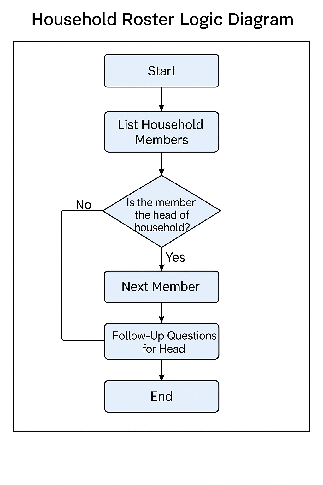

# 🧠 SurveyCTO Head-Driven Skip Logic Household Roster

This bilingual SurveyCTO form helps enumerators list household members and automatically trigger follow-up questions for the head of household only. Built with indexed-repeat logic and conditional relevance, it ensures clean, targeted data collection for field teams and researchers.

---

## 📦 What’s Included

- ✅ Repeat group for listing household members
- ✅ Auto-identification of head using relationship field
- ✅ Indexed reference to head’s name and position
- ✅ Follow-up questions shown only for the head
- ✅ Bilingual labels (English and Bangla)
- ✅ Modular XLSForm structure for easy customization

---

## 🧠 Code Logic Explained (For Learners)

| 🔧 Expression | 💡 What It Does | 🧑‍🏫 Simple Explanation |
|--------------|----------------|-------------------------|
| `position(..)` | Assigns a unique ID to each household member | Think of it like numbering each person: 1st, 2nd, 3rd... |
| `if(${relationship}='head', 1, 0)` | Flags the head of household | If someone is marked as "head", this returns 1 (true); otherwise 0 |
| `max(${is_head_local})` | Stores the index of the head | Finds the position of the person marked as head |
| `indexed-repeat(${name}, ${hh_member}, ${head_index})` | Pulls the head’s name from the repeat group | It looks up the name of the person marked as head |
| `position(..) = ${head_index}` | Flags current repeat as head | Used to trigger follow-up questions only for the head |
| `relevant: ${is_head}=1` | Shows follow-up questions only for the head | Ensures head-specific questions are hidden for others |

---

## 🌐 Languages Supported

- **English** – Default labels and hints
- **Bangla** – Parallel labels for field-level clarity

---

## 📥 Download the XLSForm

You can download the latest version of the **Head-Driven Skip Logic Household Roster** directly from this repository:

**🔗 [Download XLSForm](assets/SurveyCTO_Head_Driven_Skip_Logic.xlsx)**

This file includes:
- Repeat group logic for listing household members
- Indexed reference to the head of household
- Conditional follow-up questions for the head only
- Bilingual labels (English and Bangla)

> Tip: After downloading, upload the `.xlsx` file to your SurveyCTO server and preview it in **Design** mode to ensure everything renders correctly before deployment.

---

## 📘 Enumerator Script (Bangla-English)

This PDF provides a bilingual script for training enumerators on how to use the household roster module effectively in the field.

**🔗 [Download Enumerator_Script_ENBN.pdf](Enumerator_Script_ENBN.pdf)**

Includes:
- Step-by-step instructions
- Head identification guidance
- Bangla-English translations
- Tips for clean data entry

---

## 🧩 Visual Logic Diagram

To help learners understand the flow of indexed logic and skip patterns, here’s a visual diagram:

**🖼️ Logic Diagram: `indexed-repeat()` Flow**  

---

---

